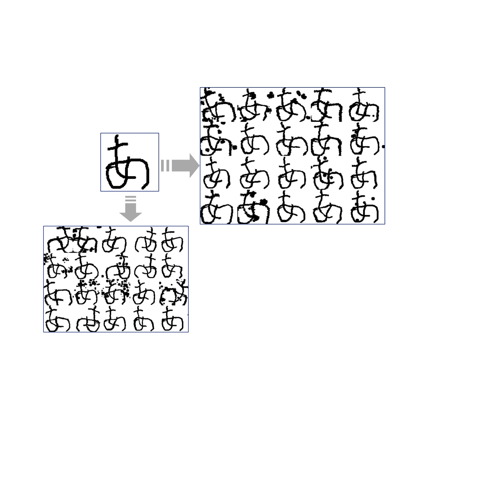

# data_augmentor_for_siamese_network_training
 Generated from the oneshot data can be used to to twin network
 In classical materials, seals are often covered by handwritten words.
 
 
 
 To split the seal areas from background ,we can project RGB three channels information of image into three-dimensional space
 
 automatically extracts areas with more red components by using k-means clustering
 
 
 -------
 
 Run:
 ```python
 python3 Binarization.py --ImageSelecter=imageDir(default='test.jpg') --clusters=K
 Ex.python Binarization.py --ImageSelecter=test.jpg  --clusters=3
 
 ```

 Authors
 -------
 
 - @Kangying Li 
 
 
 License
 -------
