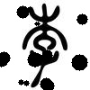

# data_augmentor_for_siamese_network_training
 Generated from the oneshot data can be used to siamese_networks

First, install augumentor:https://github.com/mdbloice/Augmentor


With this simple tool you can add a random noise to the image:
 
 
 
 By default, 20 pics are generated for each original pic

 
 
 -------
 
 Run:
 ```python
 python3 dataAugumentation.py ----ImageDir_Selecter=imageDir(default='japanese') ----Probability=(0.5-1)
 Ex.python Binarization.py --ImageSelecter=test.jpg  --clusters=3
 
 ```
ImageDir_Selecter is the directory where you store your images
The Probability is the Probability of adding noise

 Authors
 -------
 
 - @Kangying Li 
 
 
 License
 -------
